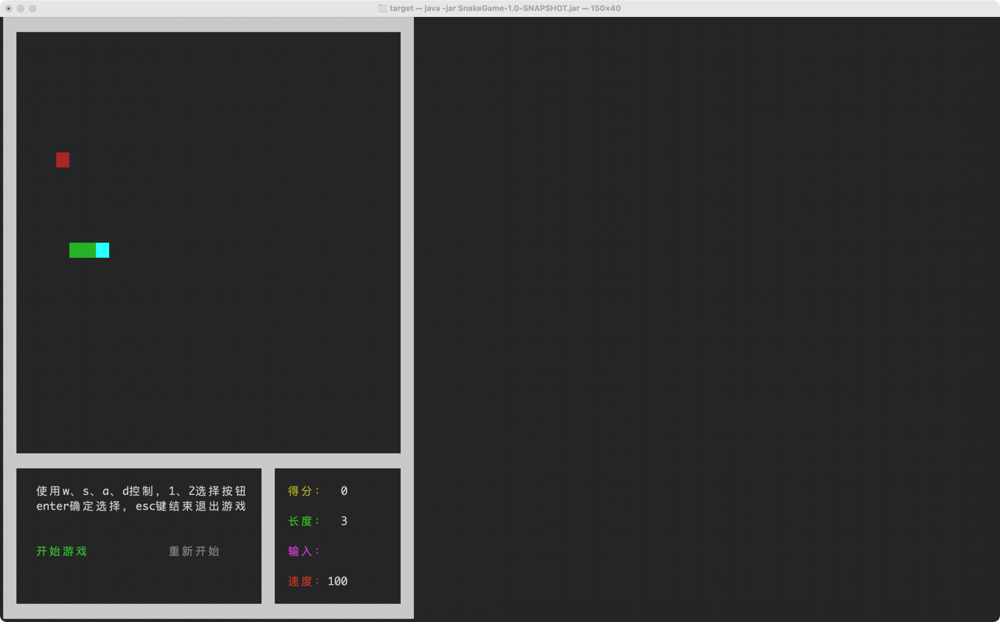

# Java贪吃蛇（控制台终端版）

## 介绍
这是一个基于 Java 开发的终端贪吃蛇小游戏，在不使用任何图形库前提，通过使用ANSI转义序列来控制终端光标位置打印实现了彩色界面和游戏交互内容

## 技术栈
- Java 17
- Maven 构建工具
- JLine 库（用于终端输入处理）
- ANSI 转义序列（用于终端颜色输出和光标控制）

````
SnakeGame/
├── src/
│   └── main/
│       └── java/
│           └── cn/
│               └── fan/
│                   └── snake/
│                       ├── engine/        - 游戏引擎核心组件
│                       │   ├── ansi/      - ANSI 终端控制
│                       │   └── keyboard/  - 键盘输入处理
│                       ├── entity/        - 游戏实体类
│                       │   ├── Snake.java - 蛇实体
│                       │   └── Food.java  - 食物实体
│                       ├── listener/      - 键盘监听器
│                       ├── ui/            - 用户界面组件
│                       │   ├── Map.java   - 游戏地图
│                       │   └── Menu.java  - 游戏菜单
│                       ├── GameManager.java - 游戏管理类
│                       └── Main.java      - 程序入口
├── pom.xml            - Maven 配置文件
└── README.md          - 项目说明文档
````

## 安装与运行

### 前提条件
- java 17或更高版本
- Maven 3.9.5或更高版本

### 构建项目
```
# 克隆项目
git clone https://github.com/EatFans/SnakeGame.git

# 使用 Maven 构建
mvn clean package
```

### 运行游戏
```
# 进入打包好的jar包目录下，使用
java -jar SnakeGame-1.0-SNAPSHOT.jar
```

### 游戏操作
- W/A/S/D : 控制蛇的移动方向（上/左/下/右）
- 1/2 : 在菜单中选择按钮
- Enter : 确认选择
- Esc : 退出游戏

### 游戏规则
1. 控制蛇移动，吃到食物后得分增加，蛇身长度增加
2. 撞到墙壁或自身会导致游戏结束
3. 游戏结束后可以选择重新开始

### 游戏截图


### 开发亮点
1. ANSI 彩色界面 : 使用 ANSI 转义序列实现了彩色的终端界面
2. 非阻塞输入 : 使用 JLine 库实现了非阻塞的键盘输入处理
3. 面向对象设计 : 采用了清晰的面向对象设计，将游戏各组件分离
4. 状态管理 : 实现了完整的游戏状态管理系统